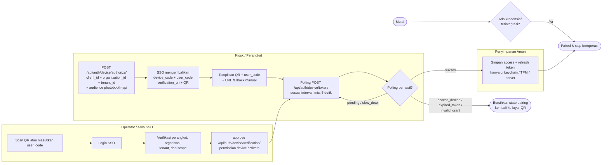
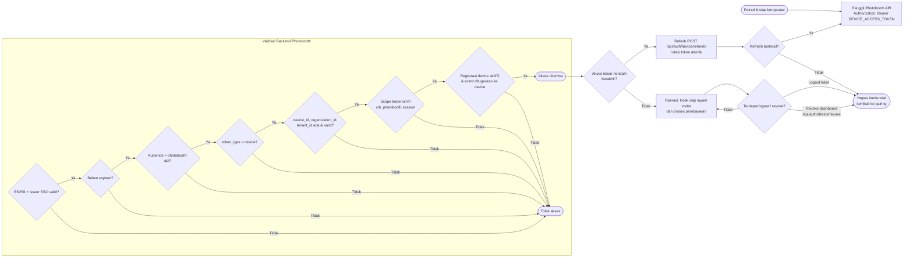

# Device Login Flow

Diagram berikut menggambarkan alur OAuth 2.0 Device Authorization Grant untuk perangkat publik (photobooth, kiosk, POS, scanner) yang dipairing oleh operator melalui Arna SSO.

## Diagram Pairing & Token

## Diagram Runtime & Lifecycle

## Catatan Kunci

- `device_code` bersifat rahasia, jangan ditampilkan ke visitor atau di-log.
- Polling tidak boleh lebih cepat dari `interval`, dan harus memperlambat saat `slow_down`.
- Token hanya untuk API `photobooth-api`; Commerce dan File Manager memakai service credential backend terpisah.
- Payment hanya boleh dipercaya dari event backend (Payment Router via Pulsar), bukan dari browser visitor.